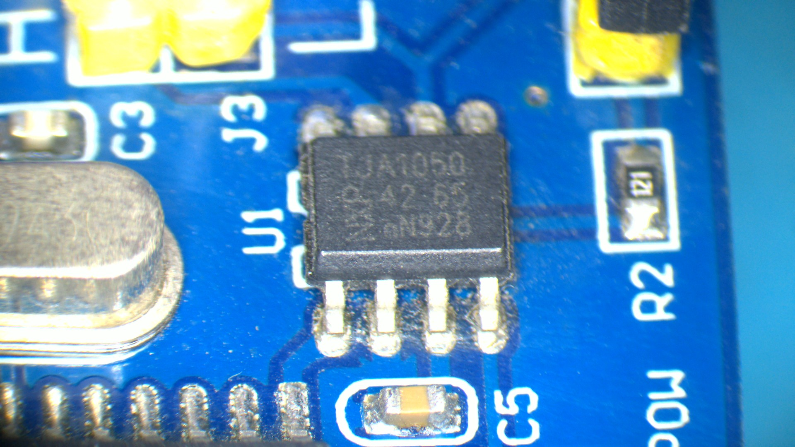
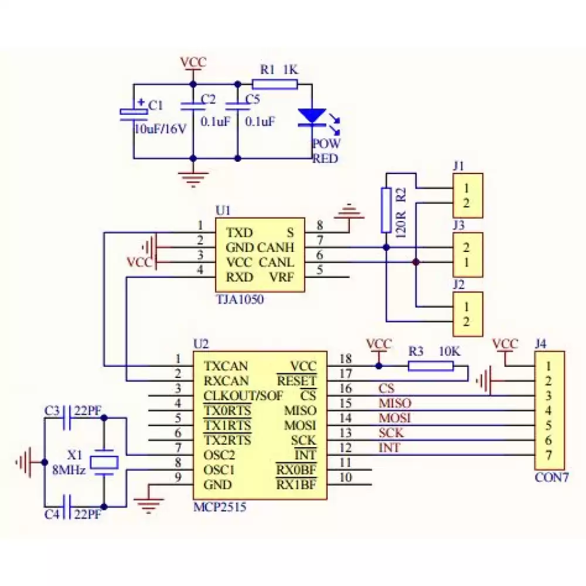

# RaspberryPi_MCP2515_CAN
RaspberryPi MCP2515 CAN Bus

  

Hi, in this repository, I will talk about how I got the MCP2515 CAN bus interface working with Raspberry Pi without any problems.

# Warning

You have to be careful when using any hardware with the Raspberry Pi, if you connect anything wrongly this might damage your board.

# Problems

As we can see, the following picture shows a schematic for the chinese CAN bus modules. The module contains two main ICs:
* MCP2515 -> This is the CAN controller IC.
* TJA1050 or maybe MCP2551 -> This is the CAN bus transceiver IC.

The problem here is that both ICs are connected to the same VCC power net. Both the TJA1050 and the MCP2515 need 5V in order to operate correctly. If you connect the VCC to 3.3V the module will not work. The only solution is to connect the VCC to 5V, this will mostly fry your board because the MCP2515 communicate with the Raspberry Pi with SPI protocol. Just immagine that you will have 5V on MISO pin ...

  

# Solutions
We have multible solutions for this problem.

## Solution 1
This solution is very simple, just cut the trace and connect the 5V to the CAN transceiver only. This repository talks about how to do this [MCP2515 CANBus module installation on RaspberryPi](https://github.com/tolgakarakurt/CANBus-MCP2515-Raspi).

From my experience, I don't recommend this solution because most students don't have the skills to edit and modify a PCB. This solution requires the following tools:
* A thin, sharp knife, similar to (medical surgery knives).
* A soldering iron is required.
* Solder (leaded solder is preferable).
* Soldering Flux.
* Isopropyl alcohol (IPA) is used to clean PCBs.

Warning: You have to make sure not to short any GPIO pin with the 5V supply. This will damage the Raspberry Pi.

## Solution 2
This solution is the most cleanest. Just replace the MCP2515/TJA1050 with the [SN65HVD230](https://www.ti.com/product/SN65HVD230). This IC works directly with 3.3V and it's pin to pin compatible with both of them.

If you are located in Egypt, you can find this IC in [UGE-Electronics](https://uge-one.com/sn65hvd230-high-speed-3-3v-can-transceiver-smd-sop8.html).

Tools required:
* A soldering rework station is required.
* Solder (leaded solder is preferable).
* Soldering Flux.
* Isopropyl alcohol (IPA) is used to clean PCBs.

If you have a repair shop, such as a mobile repair shop or an electronics home appliance repair shop, that is nearby, you can ask them to replace the IC for you.